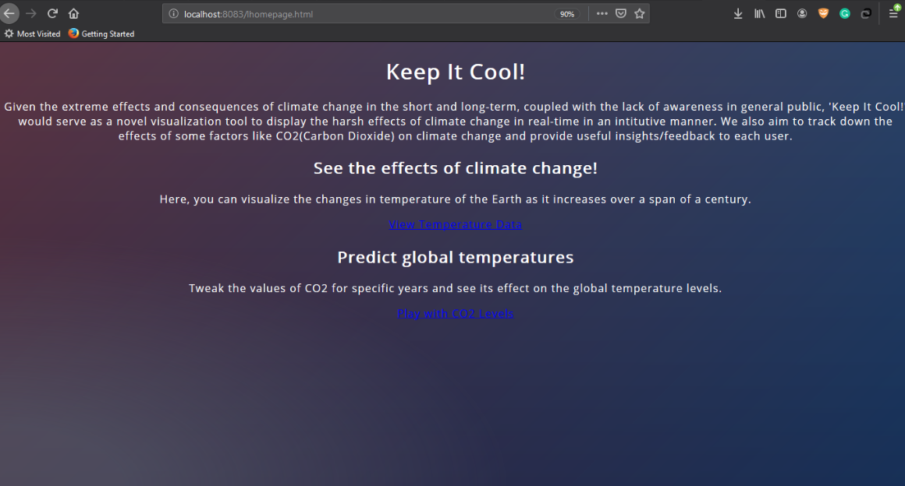
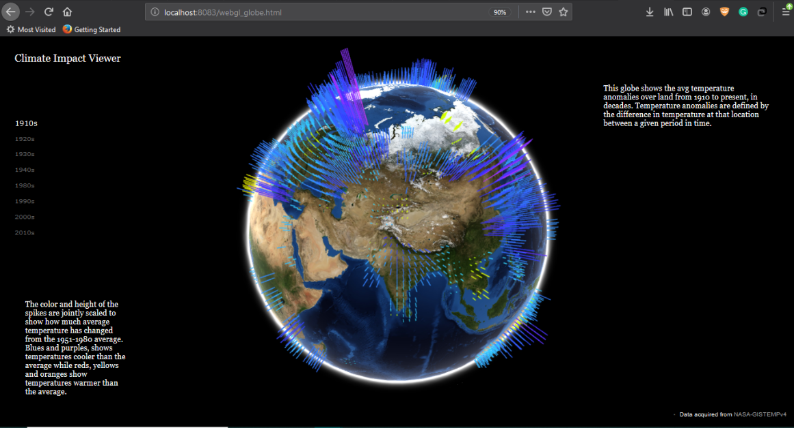
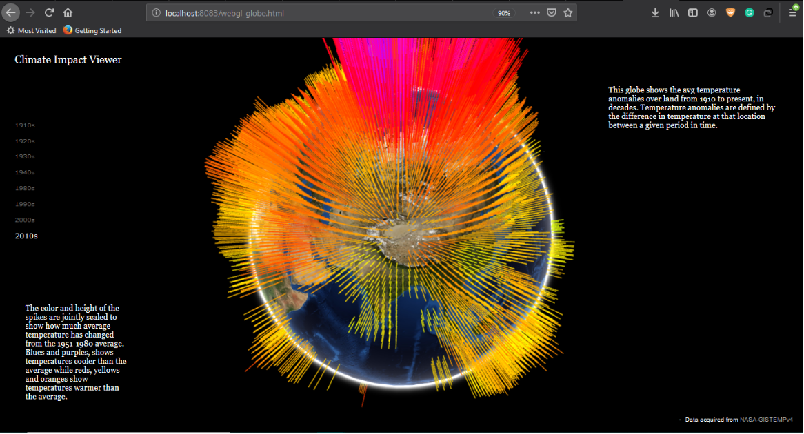
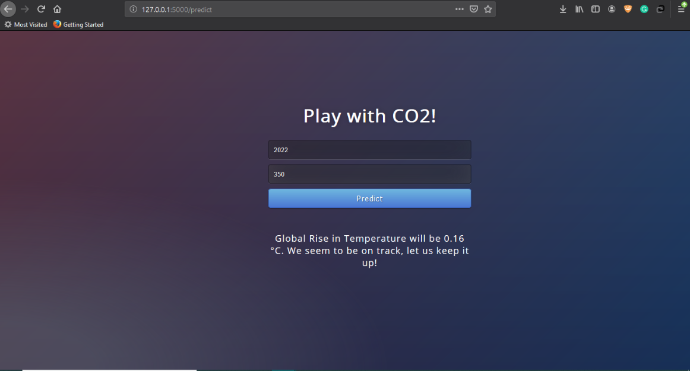
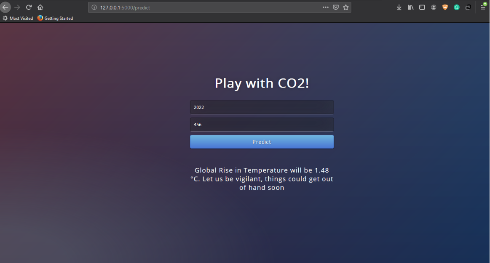
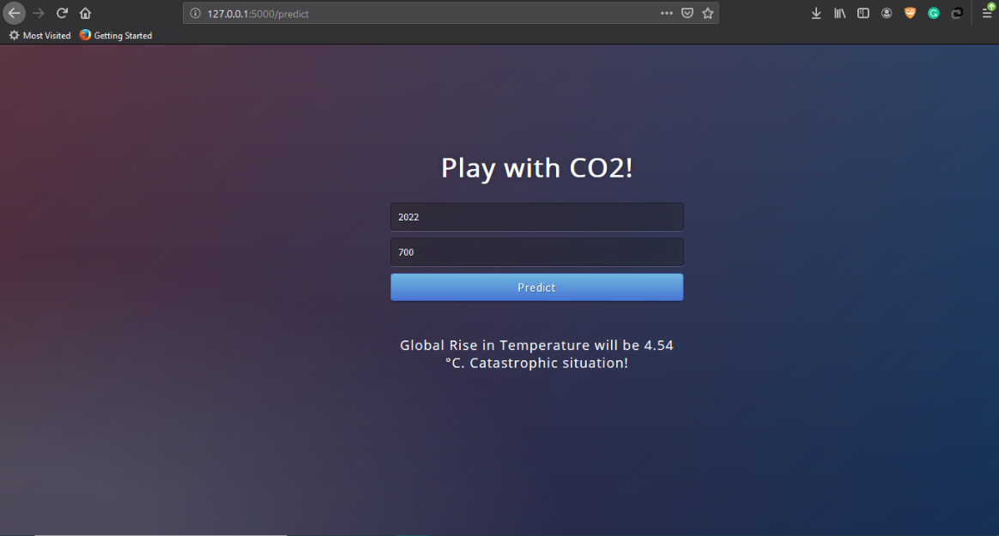

# climate-impact-visualizer
<pre>                                         </pre>

# Keep-it-cool
Presented at NASA International Spaceapps 2019 <br/>
<br/>
Refer 'Team Kugelblitz.pptx' for our full work and roadmap.



## Climate change impact visualizer
Keep it cool is visualization tool that maps NASA's GISTEMP data on a WebGL based globe, and displays the impact of climate change on global mean temperature over the past century. This visualization work was inspired by the work done by Chrome Experiments (WebGL) and people like A. Sweeney, Yoshua Bengio and many others' work in visualizing climate change.<br/>
Red/orange spikes = higher global temperatures than average (anomalies)<br/>
Blue/purple spikes = lower global temperatures than average <br/>
### 1910s
 <br/>
### 2010s
 <br/>

## Global mean temperature predictor 
We implemented a regression model that can tell the global temperature at any time in the future, given the CO2 emissions. It provides an interactive feedback for the user to play around with and see what the effects of CO2 emissions in the future years, could mean for the global mean temperatures.

### Example
First field: Year <br/>
Second field: CO2 levels in ppm <br/>
 <br/>
 <br/>
 <br/>

## Instructions
```
git clone https://github.com/Starlord6199/climate-impact-visualizer.git
cd climate-impact-visualizer
python -m http.server 8088
```
In another terminal instance, enter these commands:
```
cd climate-impact-visualizer/webanalysis
python appy.py
```
Then open the webapp, by simply clicking on 'lhomepage.html'.


